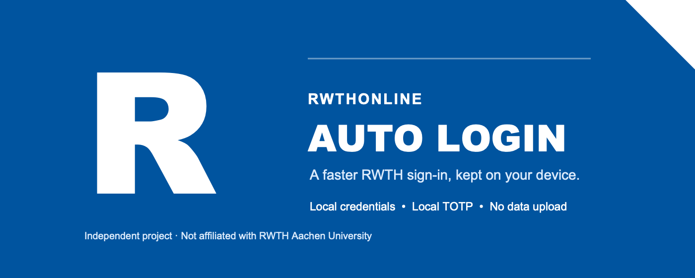

<p align="center">
  
</p>

<p align="center">
  <strong>中文</strong> · <a href="#english">English</a> · <a href="#deutsch">Deutsch</a>
</p>

# RWTHonline Auto Login

> 一个独立的桌面 Chrome 扩展，帮助你在支持的 RWTH Aachen 登录页面上减少重复输入。

## 中文

### 它做什么

首次配置后，扩展会在支持的 RWTH Aachen 登录流程中填写你的用户名、密码和当前 TOTP 验证码。它只在 RWTH Aachen 域名上运行，不会在其他网站扫描、读取或注入内容。

### 快速开始

1. 从 Chrome 网上应用店安装扩展（商店版本正在审核中）。
2. 打开扩展菜单，选择“设置账号与 Token”。
3. 按页面提示安装一次开源本机助手；它只负责访问 macOS Keychain 或 Windows Credential Manager。
4. 输入自己的 RWTH 用户名和密码，从本机选择自己的 Token 二维码图片。
5. 阅读并确认数据处理提示，保存配置。

之后访问支持的 RWTH 登录页时，扩展会自动完成已配置的登录步骤。需要更换账号或 Token 时，从扩展菜单选择“重新配置账号与 Token”。

### 隐私与范围

- 用户名、密码和 TOTP 密钥保存在本机系统保险库中，不保存在 Chrome Sync。
- Token 二维码只在本机解析；凭据、二维码、验证码和活动记录不会发送给开发者或第三方。
- 扩展仅访问 RWTH Aachen 登录流程所需的页面。
- 这是独立项目，不隶属或代表 RWTH Aachen University。

详细步骤请看 [使用说明](USAGE.md)。数据处理请看 [隐私政策](PRIVACY.md)、[用户声明](USER_NOTICE.md) 与 [单一用途和权限说明](PERMISSIONS.md)。

### 支持与反馈

遇到问题、发现兼容性变化或有功能建议，请先查看 [支持信息](SUPPORT.md)，再提交 [GitHub Issue](https://github.com/leonhartkun/rwthonline-auto-login/issues)。请不要在 Issue 中提交用户名、密码、二维码、TOTP 密钥、验证码或 Cookie。

需要增加新的界面语言？欢迎在 Issue 中告诉开发者你需要的语言和使用场景。

如果这个项目对你有帮助，欢迎给仓库点一个 Star；这能帮助更多 RWTH 用户找到它。

---

<a id="english"></a>

## English

### What it does

After one-time setup, this independent desktop Chrome extension fills the configured username, password, and current TOTP code on supported RWTH Aachen sign-in flows. It runs only on RWTH Aachen domains and does not scan, read, or inject content on other websites.

### Quick start

1. Install the extension from the Chrome Web Store (the store listing is under review).
2. Open the extension menu and select **Configure account and Token**.
3. Install the open-source local helper once. It only accesses macOS Keychain or Windows Credential Manager.
4. Enter your own RWTH username and password, then select your Token QR-code image from this device.
5. Read and acknowledge the data-handling notice, then save the configuration.

When you later visit a supported RWTH sign-in page, the extension completes the configured steps automatically. Use **Reconfigure account and Token** in the extension menu to update credentials or the Token.

### Privacy and scope

- The username, password, and TOTP secret are kept in the local operating-system credential vault, not in Chrome Sync.
- The Token QR code is decoded locally. Credentials, QR codes, TOTP codes, and activity records are not sent to the developer or third parties.
- The extension accesses only the RWTH Aachen pages needed for its sign-in function.
- This is an independent project and is not affiliated with or endorsed by RWTH Aachen University.

Read the [usage guide](USAGE.md), [Privacy Policy](PRIVACY.md), [User Notice](USER_NOTICE.md), and [single-purpose and permission details](PERMISSIONS.md) for full details.

### Support and feedback

For bugs, compatibility changes, or feature ideas, read the [support information](SUPPORT.md) and open a [GitHub Issue](https://github.com/leonhartkun/rwthonline-auto-login/issues). Never include credentials, QR codes, TOTP secrets, one-time codes, cookies, or session data in an issue.

Need another interface language? Please contact the developer through an issue with the requested language and your use case.

If the project is useful to you, a GitHub Star helps other RWTH users discover it.

---

<a id="deutsch"></a>

## Deutsch

### Was die Erweiterung macht

Nach der einmaligen Einrichtung trägt diese unabhängige Desktop-Chrome-Erweiterung den konfigurierten Benutzernamen, das Passwort und den aktuellen TOTP-Code in unterstützte RWTH-Aachen-Anmeldeabläufe ein. Sie läuft ausschließlich auf RWTH-Aachen-Domains und liest oder verändert keine anderen Websites.

### Schnellstart

1. Installiere die Erweiterung aus dem Chrome Web Store (der Store-Eintrag wird derzeit geprüft).
2. Öffne das Erweiterungsmenü und wähle **Konto und Token konfigurieren**.
3. Installiere den quelloffenen lokalen Helfer einmalig. Er greift ausschließlich auf den macOS-Schlüsselbund oder die Windows-Anmeldeinformationsverwaltung zu.
4. Gib deinen eigenen RWTH-Benutzernamen und dein Passwort ein und wähle das Token-QR-Bild von diesem Gerät aus.
5. Lies den Hinweis zur Datenverarbeitung, bestätige ihn und speichere die Konfiguration.

Beim späteren Aufruf einer unterstützten RWTH-Anmeldeseite führt die Erweiterung die konfigurierten Schritte automatisch aus. Über **Konto und Token neu konfigurieren** im Erweiterungsmenü kannst du Zugangsdaten oder Token aktualisieren.

### Datenschutz und Geltungsbereich

- Benutzername, Passwort und TOTP-Geheimnis bleiben im lokalen System-Schlüsselbund und werden nicht mit Chrome Sync synchronisiert.
- Der Token-QR-Code wird lokal ausgewertet. Zugangsdaten, QR-Codes, TOTP-Codes und Aktivitätsprotokolle werden weder an den Entwickler noch an Dritte gesendet.
- Die Erweiterung greift nur auf RWTH-Aachen-Seiten zu, die für die Anmeldefunktion erforderlich sind.
- Dies ist ein unabhängiges Projekt und nicht mit der RWTH Aachen University verbunden oder von ihr unterstützt.

Weitere Informationen findest du in der [Nutzungsanleitung](USAGE.md), der [Datenschutzerklärung](PRIVACY.md), dem [Nutzungshinweis](USER_NOTICE.md) und der [Erklärung zu Zweck und Berechtigungen](PERMISSIONS.md).

### Unterstützung und Feedback

Bei Fehlern, Änderungen der Kompatibilität oder Funktionswünschen lies bitte zuerst die [Support-Informationen](SUPPORT.md) und eröffne anschließend ein [GitHub Issue](https://github.com/leonhartkun/rwthonline-auto-login/issues). Bitte niemals Zugangsdaten, QR-Codes, TOTP-Geheimnisse, Einmalcodes, Cookies oder Sitzungsdaten in einem Issue veröffentlichen.

Du benötigst eine weitere Oberflächensprache? Teile dem Entwickler bitte über ein Issue die gewünschte Sprache und den Anwendungsfall mit.

Wenn dir das Projekt hilft, unterstützt ein GitHub Star dabei, dass weitere RWTH-Nutzer es finden.

---

## Development

```sh
node --test extension/tests/*.test.mjs
node --check extension/onboarding.js
./scripts/package_extension.sh
```

`dist/rwthonline_auto_login.zip` is the Chrome Web Store upload package. It does not include the developer key, native helper, logs, or tests.

## Platform scope

This is a desktop Chrome extension. Chrome Web Store extensions cannot be installed as Chrome extensions on iPhone or iPad.
